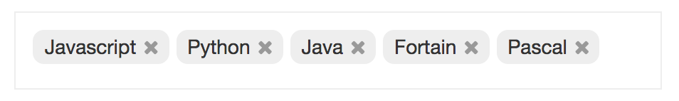

Reactlet Tagline
================

Reactlet tagline component



```
<link rel="stylesheet" href="/component/common/common-style.css"/>
<link rel="stylesheet" href="/component/treeview/treeview.css"/>

<script src="/library/react/react.js"></script>
<script src="/library/react/JSXTransformer.js"></script>
<script type="text/jsx" src="/component/common/common-mixin.js"></script>
<script type="text/jsx" src="/component/treeview/treeview.js"></script>


app.tagline2Data = {
    items: [
        { text:'Javascript', id:'js' },
        { text:'Python', id:'python' },
        { text:'Basic', id:'basic' },
        { text:'Java', id:'java' },
        { text:'Fortain', id:'fortrain' },
        { text:'Pascal', id:'pascal' }
    ]
};
app.tagline2 = React.renderComponent(
    <Tagline data={ app.tagline2Data } />,
    document.getElementById('box2')
);
```
